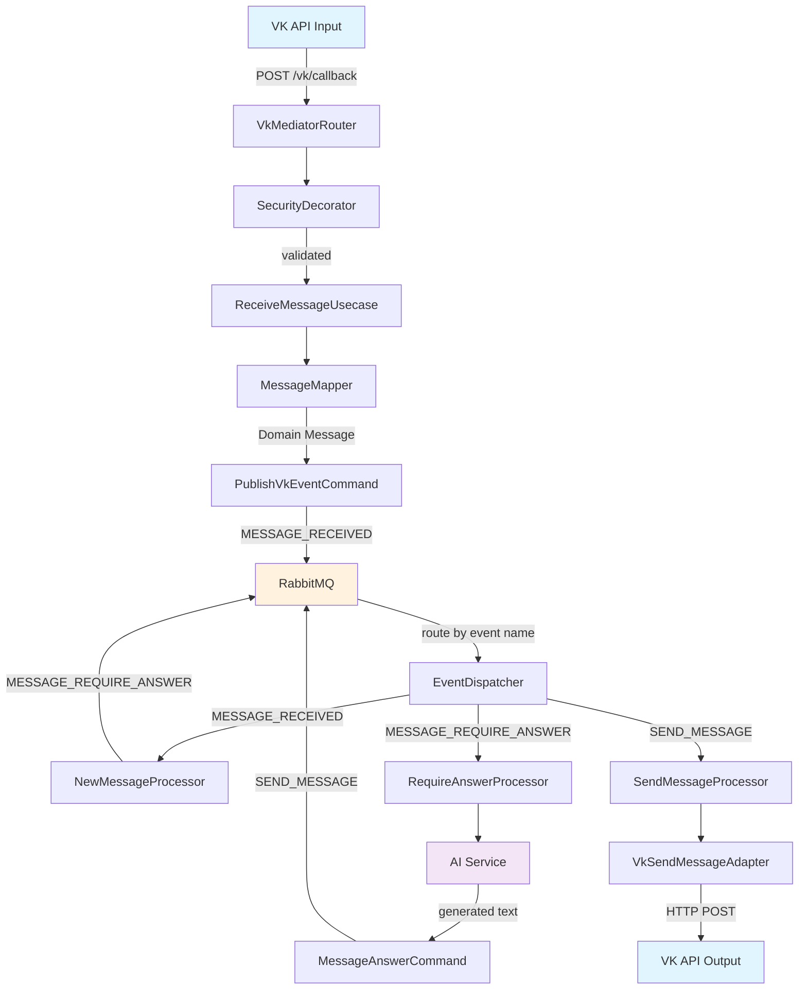
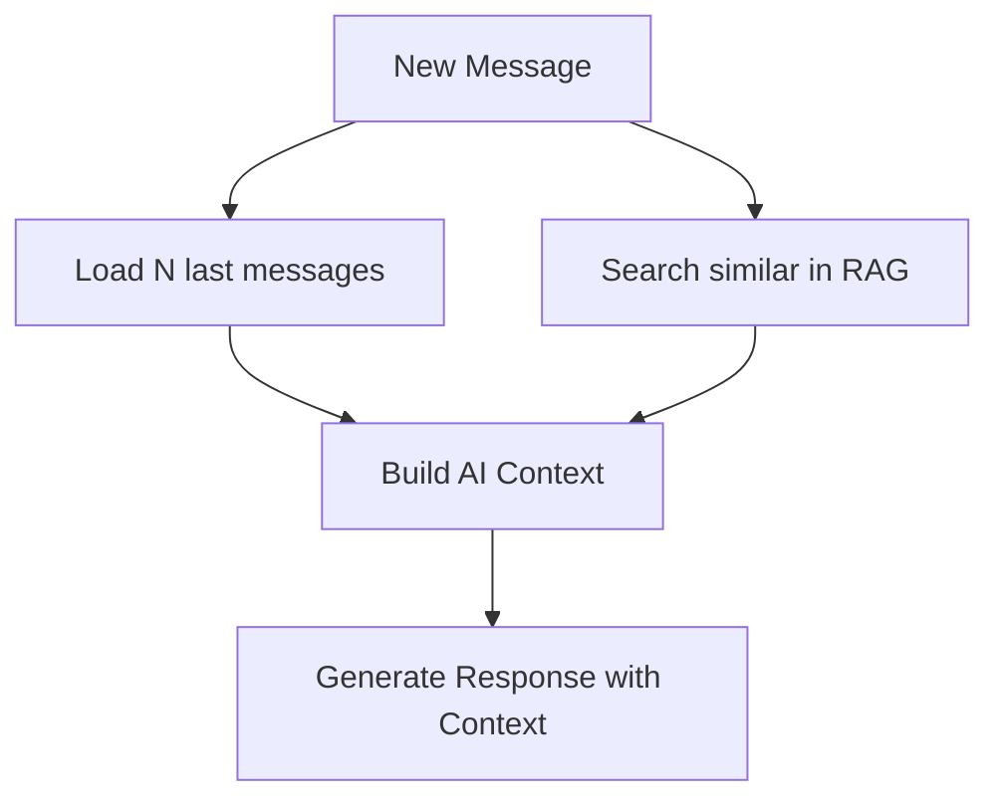

# Поток данных

Документ описывает как данные проходят через систему от получения VK webhook'а до отправки ответа пользователю.

## 🔄 Общая схема потока



## 📊 Детальный анализ этапов

### 1️⃣ Входящий webhook (VK → receiver)

**Входные данные**:
```json
{
  "type": "message_new",
  "object": {
    "message": {
      "text": "Привет, бот!",
      "from_id": 173308266,
      "peer_id": 2000000001,
      "conversation_message_id": 2670,
      "date": 1756381457
    }
  },
  "group_id": 232142875,
  "secret": "secret_key"
}
```

**Обработка**:
1. `VkMediatorRouterSecurityDecorator` проверяет `secret`
2. `VkMediatorRouterImpl` вызывает `ReceiveMessageInputPort`
3. `ReceiveMessageUsecase` определяет тип события:
   - `confirmation` → возвращает код подтверждения
   - `message_new` → публикует событие
   - `unknown` → логирует и возвращает "ok"

**Преобразования**:
```kotlin
// VK JSON → VkEvent → Domain Event
VkCallbackEvent.MESSAGE_NEW → Event.MESSAGE_RECEIVED
```

### 2️⃣ Event routing (RabbitMQ)

**Публикация события**:
```kotlin
PublishEventOutputPortRequest(
    event = Event.MESSAGE_RECEIVED,
    payload = Payload(domainMessage)
)
```

**RabbitMQ конфигурация**:
- **Exchange**: `all-events` (topic)
- **Routing key**: `MESSAGE_RECEIVED` (event name)
- **Queue**: `queue` (consumer queue)

**Диспетчеризация**:
```kotlin
val processors: Map<String, EventProcessor> = [
    "MESSAGE_RECEIVED" → MessageNewEventProcessor,
    "MESSAGE_REQUIRE_ANSWER" → MessageRequireAnswerProcessor,
    "SEND_MESSAGE" → SendMessageEventProcessor
]
```

### 3️⃣ Обработка нового сообщения (processor)

**MessageNewEventProcessor**:
```kotlin
// JSON → Domain Message
val message = objectMapper.readValue(jsonString, Message::class.java)
messageNewInputPort.execute(MessageNewInputPortRequest(message))
```

**NewMessageUsecaseInput логика**:
```kotlin
override fun execute(request: MessageNewInputPortRequest): MessageNewInputPortResponse {
    if(requireAnswer(request)) {
        publishEventCommand.execute(
            PublishEventRequest(
                event = Event.MESSAGE_REQUIRE_ANSWER,
                payload = Payload(request.message)
            )
        )
    }
    return okResponse
}
```

**Планируемые доработки**:
- Сохранение в БД
- Добавление в RAG систему
- Проверка логики `requireAnswer()`

### 4️⃣ Генерация ответа (processor → ai)

**MessageRequireAnswerProcessor**:
```kotlin
val aiResponse = messageAnswerTextGenerateCommand.execute(
    MessageAnswerTextGenerateCommandRequest(initialMessage)
)

val answerMessage = initialMessage.answer(aiResponse.messageText)
publishEventCommand.execute(PublishEventRequest(
    event = Event.SEND_MESSAGE,
    payload = Payload(answerMessage)
))
```

**AI интеграция (LangChain4j)**:
```kotlin
@RegisterAiService
@SystemMessage("You are a helpful ai chatbot in a chat. Your task is to answer user questions in Russian.")
interface UserAnswerAiService {
    @UserMessage("User message: {message}")
    fun answerUser(@V("message") message: String): String
}
```

**Создание ответного сообщения**:
```kotlin
fun Message.answer(text: MessageText): Message {
    return this.copy(messageText = text)  // Сохраняем все поля, меняем только текст
}
```

### 5️⃣ Отправка ответа (vkFacade → VK)

**SendMessageEventProcessor**:
```kotlin
val message = objectMapper.readValue(jsonString, Message::class.java)
vkSendMessageInputPort.execute(VkSendMessageInputRequest(message.peerId, message.messageText))
```

**VK API запрос**:
```http
POST https://api.vk.ru/method/messages.send
Authorization: Bearer {VK_API_TOKEN}
Content-Type: application/x-www-form-urlencoded

peer_id=2000000001&message=Привет! Как дела?&random_id=0&v=5.131&disable_mentions=1
```

**Обработка ошибок**:
```kotlin
val vkResponse = vkClient.sendMessage(peerId, message, rand = 0)
if(vkResponse.error != null) {
    throw VkException("${vkResponse.error.error_msg}(${vkResponse.error.error_code})")
}
```

## ⚡ Асинхронность и производительность

### Event-driven преимущества
- **Неблокирующая обработка**: VK webhook возвращается мгновенно
- **Отказоустойчивость**: сбой AI не влияет на прием webhook'ов
- **Горизонтальное масштабирование**: можно запускать множество обработчиков

### RabbitMQ конфигурация
```yaml
mp:
  messaging:
    incoming:
      all-events-queue:
        connector: smallrye-rabbitmq
        exchange:
          name: all-events
        queue:
          name: queue
    outgoing:
      events-exchange:
        connector: smallrye-rabbitmq
        exchange:
          name: all-events
```

### Виртуальные потоки (Project Loom)
```kotlin
@Incoming("all-events-queue")
@RunOnVirtualThread  // Легковесные потоки для I/O операций
fun dispatch(message: Message<String>): CompletionStage<Void>
```

## 🔍 Трассировка и observability

### Логирование на каждом этапе
```kotlin
@Decorator
class CommandLoggingDecorator<REQ: CommandRequest, RESP: CommandResponse>(
    @Delegate val delegate: Command<REQ, RESP>,
    val objectMapper: ObjectMapper
): Command<REQ, RESP> {
    override fun execute(request: REQ): RESP {
        if(Log.isTraceEnabled()) {
            Log.trace("Incoming command request: ${objectMapper.writeValueAsString(request)}")
        }
        val response = delegate.execute(request)
        if(Log.isTraceEnabled()) {
            Log.trace("Outcoming command response: ${objectMapper.writeValueAsString(response)}")
        }
        return response
    }
}
```

### OpenTelemetry integration
- Трассировка всего потока от webhook до ответа
- Метрики производительности каждого этапа
- Корреляция логов по conversation_message_id

## 🚀 Планируемые улучшения потока

### Добавление контекста (memory модуль)


### State Machine координация (processor эволюция)
```kotlin
sealed class DialogState {
    object WaitingForMessage : DialogState()
    data class LoadingContext(val message: Message) : DialogState()
    data class GeneratingResponse(val message: Message, val context: Context) : DialogState()
    data class SendingResponse(val response: Message) : DialogState()
}
```

### AI Router (ai модуль)
```kotlin
interface AiProvider {
    fun generateResponse(context: Context, message: Message): ResponseCandidate
}
```

Поток данных спроектирован с учетом масштабируемости и гибкости, что позволяет легко добавлять новые этапы обработки без изменения существующего кода.
