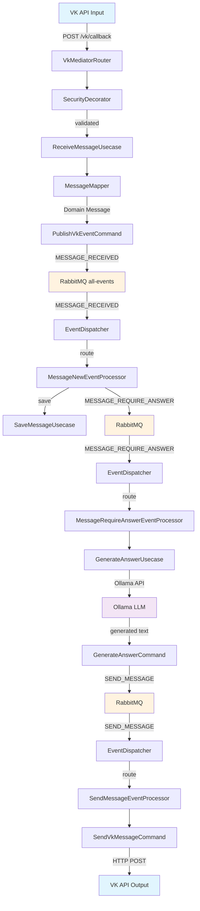
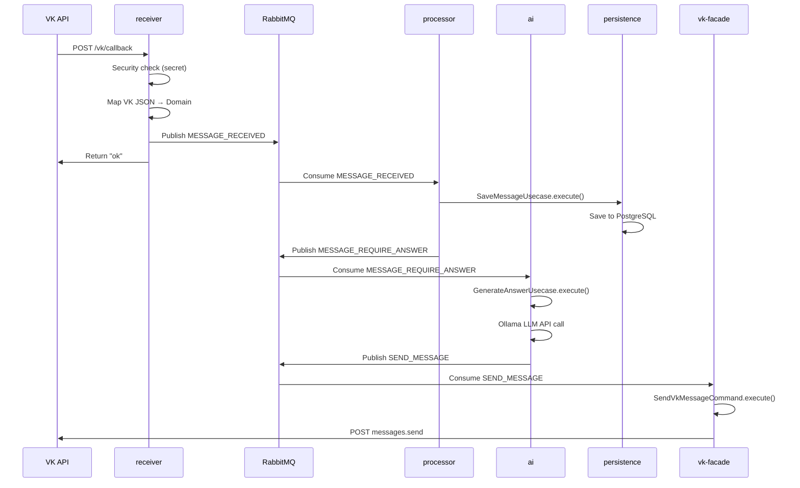

# Поток данных

Документ описывает как данные проходят через систему от получения VK webhook'а до отправки ответа пользователю.

## Общая схема потока


```mermaid
flowchart TD
    VK_IN[VK API Input] -->|POST /vk/callback| Router[VkMediatorRouter]
    Router --> Security[SecurityDecorator]
    Security -->|validated| UseCase[ReceiveMessageUsecase]
    UseCase --> Mapper[MessageMapper]
    Mapper -->|Domain Message| Publisher[PublishVkEventCommand]
    Publisher -->|MESSAGE_RECEIVED| MQ[RabbitMQ all-events]

    MQ -->|MESSAGE_RECEIVED| Dispatcher[EventDispatcher]
    Dispatcher -->|route| NewMsg[MessageNewEventProcessor]
    NewMsg -->|save| Persistence[SaveMessageUsecase]
    NewMsg -->|MESSAGE_REQUIRE_ANSWER| MQ2[RabbitMQ]

    MQ2 -->|MESSAGE_REQUIRE_ANSWER| Dispatcher2[EventDispatcher]
    Dispatcher2 -->|route| RequireAnswer[MessageRequireAnswerEventProcessor]
    RequireAnswer --> AI[GenerateAnswerUsecase]
    AI -->|Ollama API| Ollama[Ollama LLM]
    Ollama -->|generated text| Command[GenerateAnswerCommand]
    Command -->|SEND_MESSAGE| MQ3[RabbitMQ]

    MQ3 -->|SEND_MESSAGE| Dispatcher3[EventDispatcher]
    Dispatcher3 -->|route| SendProcessor[SendMessageEventProcessor]
    SendProcessor --> VkFacade[SendVkMessageCommand]
    VkFacade -->|HTTP POST| VK_OUT[VK API Output]

    style VK_IN fill:#e1f5fe
    style VK_OUT fill:#e1f5fe
    style MQ fill:#fff3e0
    style MQ2 fill:#fff3e0
    style MQ3 fill:#fff3e0
    style Ollama fill:#f3e5f5
```

## Детальный анализ этапов

### 1. Входящий webhook (VK → receiver)

**Входные данные**:
```json
{
  "type": "message_new",
  "object": {
    "message": {
      "text": "Привет, бот!",
      "from_id": 173308266,
      "peer_id": 2000000001,
      "conversation_message_id": 2670,
      "date": 1756381457
    }
  },
  "group_id": 232142875,
  "secret": "secret_key"
}
```

**Обработка**:
1. `VkMediatorRouterSecurityDecorator` проверяет `secret`
2. `VkMediatorRouterImpl` вызывает `ReceiveMessageInputPort`
3. `ReceiveMessageUsecase` определяет тип события:
   - `confirmation` → возвращает код подтверждения
   - `message_new` → публикует событие MESSAGE_RECEIVED
   - `unknown` → логирует и возвращает "ok"

**Преобразования**:
```kotlin
// VK JSON → VkEvent → Domain Event
VkCallbackEvent.MESSAGE_NEW → Event.MESSAGE_RECEIVED
```

---

### 2. Event routing (RabbitMQ)

**Публикация события**:
```kotlin
PublishEventOutputPortRequest(
    event = Event.MESSAGE_RECEIVED,
    payload = Payload(domainMessage)
)
```

**RabbitMQ конфигурация**:
- **Exchange**: `all-events` (topic)
- **Routing key**: `MESSAGE_RECEIVED` (event name)
- **Queue**: `queue` (consumer queue)

**Стратегии повторных попыток**:
```
all-events → (fail) → retry-5s-queue (TTL 5s) → all-events
                     ↓
              retry-30s-queue (TTL 30s) → all-events
                     ↓
              retry-1m-queue (TTL 1m) → all-events
                     ↓
              retry-15m-queue (TTL 15m) → all-events
                     ↓
              retry-1h-queue (TTL 1h) → all-events
                     ↓
              dlq-final-queue (final dead letter queue)
```

**Диспетчеризация**:
```kotlin
val processors: Map<String, EventProcessor> = [
    "MESSAGE_RECEIVED" → MessageNewEventProcessor,
    "MESSAGE_REQUIRE_ANSWER" → MessageRequireAnswerEventProcessor,
    "SEND_MESSAGE" → SendMessageEventProcessor
]
```

---

### 3. Обработка нового сообщения (processor + persistence)

**MessageNewEventProcessor**:
```kotlin
// JSON → Domain Message
val message = objectMapper.readValue(jsonString, Message::class.java)
messageNewInputPort.execute(MessageNewInputPortRequest(message))
```

**NewMessageUsecaseInput логика**:
```kotlin
override fun execute(request: MessageNewInputPortRequest): MessageNewInputPortResponse {
    // Сохраняем сообщение
    saveMessageUsecase.execute(request.message)

    // Проверяем нужен ли ответ
    if(requireAnswer(request)) {
        publishEventCommand.execute(
            PublishEventRequest(
                event = Event.MESSAGE_REQUIRE_ANSWER,
                payload = Payload(request.message)
            )
        )
    }
    return okResponse
}
```

**Persistence**:
```kotlin
@Entity
@Table(name = "messages")
class MessageEntity(
    @Id @GeneratedValue val id: Long? = null,
    val fromId: Long,
    val peerId: Long,
    val messageText: String,
    @Convert(converter = JsonbConverter::class)
    val metadata: Map<String, Any>
)
```

---

### 4. Генерация ответа (ai модуль)

**MessageRequireAnswerEventProcessor**:
```kotlin
val message = objectMapper.readValue(jsonString, Message::class.java)

// Генерируем ответ через AI
val answerResponse = generateAnswerInputPort.execute(
    GenerateAnswerInputPortRequest(message)
)

// Публикуем событие отправки
val answerMessage = message.answer(answerResponse.generatedText)
publishEventCommand.execute(PublishEventRequest(
    event = Event.SEND_MESSAGE,
    payload = Payload(answerMessage)
))
```

**AI интеграция (LangChain4j + Ollama)**:
```kotlin
@RegisterAiService
@SystemMessage("Ты - полезный бот в беседе. Твоя задача - отвечать на вопросы пользователей.")
interface UserAnswerAiService {
    @UserMessage("Сообщение пользователя: {message}")
    fun answerUser(@V("message") message: String): String
}
```

**GenerateAnswerOutputAdapter**:
```kotlin
class GenerateAnswerOutputAdapter(
    private val aiService: UserAnswerAiService
): GenerateAnswerOutputPort {
    override fun execute(request: GenerateAnswerOutputPortRequest): GenerateAnswerOutputPortResponse {
        val answer = aiService.answerUser(request.message.messageText.value)
        return GenerateAnswerOutputPortResponse(MessageText.of(answer))
    }
}
```

**Создание ответного сообщения**:
```kotlin
fun Message.answer(text: MessageText): Message {
    return this.copy(
        messageText = text,
        fromId = botId,  // Меняем отправителя на бота
        date = Date.now()
    )
}
```

---

### 5. Отправка ответа (vk-facade → VK)

**SendMessageEventProcessor**:
```kotlin
val message = objectMapper.readValue(jsonString, Message::class.java)
sendVkMessageInputPort.execute(
    SendVkMessageInputPortRequest(message.peerId, message.messageText)
)
```

**SendVkMessageCommand**:
```kotlin
class SendVkMessageCommandImpl(
    private val vkSendMessageOutputPort: VkSendMessageOutputPort
): SendVkMessageCommand {
    override fun execute(request: SendVkMessageCommandRequest): SendVkMessageCommandResponse {
        val response = vkSendMessageOutputPort.execute(
            VkSendMessageOutputPortRequest(
                peerId = request.peerId,
                message = request.message
            )
        )
        return SendVkMessageCommandResponse(response.messageId)
    }
}
```

**VK API запрос**:
```http
POST https://api.vk.ru/method/messages.send
Authorization: Bearer {VK_API_TOKEN}
Content-Type: application/x-www-form-urlencoded

peer_id=2000000001&message=Привет!+Как+дела%3F&random_id=12345&v=5.199&disable_mentions=1
```

**Обработка ошибок**:
```kotlin
val vkResponse = vkClient.sendMessage(peerId, message, randomId)
if(vkResponse.error != null) {
    throw VkException("${vkResponse.error.error_msg} (${vkResponse.error.error_code})")
}
```

---

## Полная последовательность (Sequence Diagram)


```mermaid
sequenceDiagram
    participant VK as VK API
    participant R as receiver
    participant MQ as RabbitMQ
    participant P as processor
    participant AI as ai
    participant PER as persistence
    participant VF as vk-facade

    VK->>R: POST /vk/callback
    R->>R: Security check (secret)
    R->>R: Map VK JSON → Domain
    R->>MQ: Publish MESSAGE_RECEIVED
    R->>VK: Return "ok"

    MQ->>P: Consume MESSAGE_RECEIVED
    P->>PER: SaveMessageUsecase.execute()
    PER->>PER: Save to PostgreSQL
    P->>MQ: Publish MESSAGE_REQUIRE_ANSWER

    MQ->>AI: Consume MESSAGE_REQUIRE_ANSWER
    AI->>AI: GenerateAnswerUsecase.execute()
    AI->>AI: Ollama LLM API call
    AI->>MQ: Publish SEND_MESSAGE

    MQ->>VF: Consume SEND_MESSAGE
    VF->>VF: SendVkMessageCommand.execute()
    VF->>VK: POST messages.send
```

---

## Асинхронность и отказоустойчивость

### Event-driven преимущества
- **Неблокирующая обработка**: VK webhook возвращается мгновенно ("ok")
- **Отказоустойчивость**: сбой в одном модуле не влияет на остальные
- **Retry механизм**: Автоматические повторы с увеличивающимися интервалами
- **Горизонтальное масштабирование**: можно запускать множество обработчиков

### Retry стратегия

```yaml
mp:
  messaging:
    incoming:
      all-events-queue:
        dead-letter-exchange: retry-5s-exchange  # При ошибке → retry
      retry-5s-queue:
        arguments:
          x-message-ttl: 5000                     # Ждем 5 секунд
          x-dead-letter-exchange: all-events     # Возвращаем в основную очередь
      # ... retry-30s, retry-1m, retry-15m, retry-1h
      dlq-final-queue:
        # Финальная очередь для необрабатываемых сообщений
```

### Виртуальные потоки (Project Loom)

```kotlin
@Incoming("all-events-queue")
@RunOnVirtualThread  // Легковесные потоки для I/O операций
fun dispatch(message: Message<String>): CompletionStage<Void> {
    // Обработка события
}
```

---

## Трассировка и observability

### OpenTelemetry интеграция

Каждый этап обработки включает tracing:

```kotlin
@ApplicationScoped
class EventDispatcher(private val tracer: Tracer) {
    @Incoming("all-events-queue")
    @RunOnVirtualThread
    fun dispatch(message: Message<String>): CompletionStage<Void> {
        val span = tracer.spanBuilder("process-event")
            .setAttribute("event.type", routingKey)
            .startSpan()

        try {
            processor.process(message.payload)
        } finally {
            span.end()
        }
    }
}
```

### Корреляция по conversation_message_id

```kotlin
// Все логи содержат идентификатор для трассировки
MDC.put("conversation_message_id", message.conversationMessageId.toString())
MDC.put("peer_id", message.peerId.toString())
log.info("Processing message: ${message.messageText}")
```

### Prometheus метрики

```kotlin
// Кастомные метрики
@Inject
lateinit var meterRegistry: MeterRegistry

fun process(message: Message) {
    meterRegistry.counter("messages.processed",
        "type", message.type
    ).increment()
}
```

---

## Производительность

### Оптимизации

1. **Батчинг**: Сообщения обрабатываются по одному, но можно настроить батчинг
2. **Кэширование**: AI ответы могут кэшироваться для частых вопросов
3. **Пул соединений**: PostgreSQL и HTTP клиенты используют пулы

### Бенчмарки

| Метрика | Значение |
|---------|----------|
| Время обработки webhook | < 10ms |
| Время генерации AI ответа | 1-3 секунды |
| Пропускная способность | Зависит от модели Ollama |
| Задержка отправки в VK | < 500ms |

---

## Расширение потока

Для добавления нового этапа обработки:

1. **Создать новый EventProcessor** в соответствующем модуле
2. **Зарегистрировать в EventDispatcher** по имени события
3. **Опубликовать новое событие** из предыдущего этапа

Пример добавления модуля антиспама:

```kotlin
@ApplicationScoped
class AntispamEventProcessor : EventProcessor {
    override fun process(payload: String) {
        val message = parseMessage(payload)
        if (isSpam(message)) {
            // Блокируем, не публикуем дальше
            return
        }
        // Публикуем очищенное сообщение
        publishEvent(Event.MESSAGE_RECEIVED_CLEANED, message)
    }
}
```

Поток данных спроектирован с учетом масштабируемости и гибкости, что позволяет легко добавлять новые этапы обработки без изменения существующего кода.
