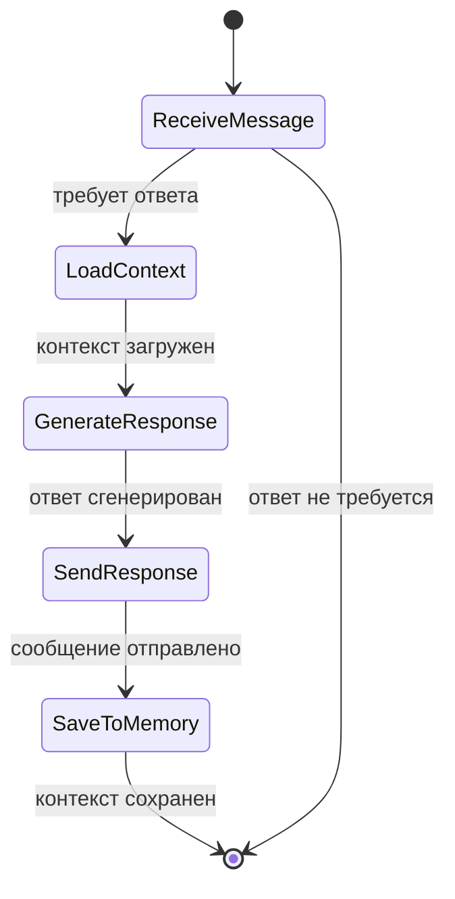

# Модульная структура

Проект организован по модульному принципу с четким разделением ответственности.
Каждый модуль выполняет свою специфическую роль в общей архитектуре системы.

## 📦 Текущие модули

### `receiver` - Точка входа системы
**Назначение**: Получение и первичная обработка webhook'ов от VK API

**Ключевые компоненты**:
- `VkMediatorRouter` - REST endpoint для VK callback'ов
- `VkMediatorRouterSecurityDecorator` - проверка секретного ключа
- `ReceiveMessageUsecase` - маршрутизация входящих событий
- `MessageMapper` - преобразование VK JSON в доменные объекты

**Паттерн DMZ (Demilitarized Zone)**:
```
VK API → Security Check → VK Event Mapping → Domain Events
```

Модуль работает как буферная зона между внешним VK API и внутренней доменной моделью, обеспечивая:
- Валидацию и безопасность входящих запросов  
- Преобразование внешних форматов во внутренние
- Изоляцию изменений в VK API от остальной системы

### `processor` - Бизнес-логика системы
**Назначение**: Обработка сообщений и координация бизнес-процессов

**Ключевые компоненты**:
- `NewMessageUsecaseInput` - обработка новых сообщений
- `MessageRequireAnswerUsecaseInput` - генерация ответов
- `MessageAnswerTextGenerateCommand` - команда генерации текста
- `AiChatbotAnswerMessageOutputAdapter` - интеграция с AI

**Текущая архитектура**:
```
Message → Decision Logic → AI Integration → Response Generation
```

**Планируемая эволюция** → State Machine:
- Координация между модулями `memory` и `ai`
- Управление состояниями диалога
- Оркестрация сложных бизнес-сценариев

### `vkFacade` - Интеграция с VK API
**Назначение**: Взаимодействие с VK API

**Ключевые компоненты**:
- `VkClient` - REST клиент для VK API
- `VkSendMessageOutputAdapter` - адаптер для отправки сообщений
- `SendVkMessageCommand` - команда отправки сообщения
- `MessageSendUsecase` - use case отправки

**Архитектура**:
```
Domain Events → VK API Mapping → HTTP Request → VK API
```

### `share` - Общие компоненты
**Назначение**: Переиспользуемые компоненты всех модулей

**Структура**:
```
share/
├── domain/
│   ├── model/Message.kt          # Основная бизнес-сущность
│   ├── vo/                       # Value Objects
│   └── Event.kt                  # Доменные события
├── port/                         # Интерфейсы портов
├── command/Command.kt            # Command pattern базовые интерфейсы
└── adapter/                      # Базовые интерфейсы адаптеров
```

**Value Objects**:
- `MessageText` - типобезопасный текст сообщения
- `PeerId` - идентификатор диалога
- `FromId` - идентификатор отправителя
- `ConversationMessageId` - идентификатор сообщения в диалоге

### `infrastructure` - Инфраструктурные компоненты
**Назначение**: Кросс-модульная инфраструктура

**Компоненты**:
- `EventDispatcher` - маршрутизация событий RabbitMQ
- `CommandLoggingDecorator` - логирование команд
- `UsecaseLoggingDecorator` - логирование use case'ов
- `MapperConfig` - конфигурация Jackson для Kotlin

## 🚀 Планируемые модули

### `memory` - Управление памятью системы
**Назначение**: Хранение и поиск контекста диалогов

**Планируемые компоненты**:
- **RAG система** - vector search по истории сообщений
- **History Service** - последние N сообщений диалога  
- **Context Builder** - формирование контекста для AI
- **User Profile** - профили пользователей на основе сообщений

**Архитектура**:
```
Message → Vector Store + Database → Context Retrieval → AI Context
```

### `ai` - AI интеграция
**Назначение**: Генерация ответов и AI-логика

**Планируемые компоненты**:
- **Multiple AI Providers** - поддержка разных AI сервисов
- **Prompt Engineering** - управление промптами
- **Response Processing** - постобработка ответов AI
- **AI Router** - выбор подходящего AI провайдера

**Архитектура**:
```
Context + Message → Prompt Building → AI Provider → Response Processing
```

### Новая роль `processor` как State Machine
После появления модулей `memory` и `ai`, процессор станет координатором:



## 🔄 Межмодульное взаимодействие

### Текущее взаимодействие
```
receiver → (events) → processor → (events) → vkFacade
    ↓
infrastructure (EventDispatcher, Logging)
```

### Планируемое взаимодействие  
```
receiver → (events) → processor (state machine)
                       ↓
                ┌──────┴──────┐
                ↓             ↓
            memory            ai
               ↓              ↓
             (events) → processor → (events) → vkFacade
```

## 🎯 Принципы модульной организации

### Разделение UseCase и Command
В архитектуре системы применяется разделение стандартных use case'ов из гексагональной архитектуры на два компонента:

**UseCase** - имплементация входящего порта:
- Описывает **что** именно должно произойти на высоком уровне
- Координирует выполнение бизнес-сценария
- Работает с доменными объектами
- Делегирует конкретную работу командам

**Command** - атомарное переиспользуемое действие:
- Описывает **как** выполнить конкретное действие
- Может иметь собственную бизнес-логику
- Использует один или несколько выходных портов
- Может переиспользоваться разными use case'ами или другими командами

```kotlin
// UseCase координирует процесс на высоком уровне
class MessageRequireAnswerUsecaseInput {
    fun execute(message: Message) {
        // Что нужно сделать
        val response = generateAnswerCommand.execute(message)  // Делегация команде
        sendMessageCommand.execute(response)                  // Делегация команде
    }
}

// Command выполняет конкретное атомарное действие
class MessageAnswerTextGenerateCommandImpl {
    fun execute(message: Message): Response {
        // Как именно генерировать ответ
        val context = contextBuilder.build(message)
        return aiOutputPort.generateResponse(context)
    }
}
```

### Слабая связанность
- Модули взаимодействуют только через события
- Нет прямых зависимостей между модулями
- Каждый модуль имеет свой контекст и ports/adapters

### Высокая связность
- Внутри модуля все компоненты работают на одну цель
- Четкое разделение на слои внутри каждого модуля
- Явные интерфейсы (ports) для внешних взаимодействий

### Независимость развертывания
- Каждый модуль может развиваться независимо
- Версионирование API между модулями через события
- Возможность горизонтального масштабирования отдельных модулей

## 📁 Структура модуля (типовая)
```
module_name/
├── adapter/
│   ├── input/          # Входящие адаптеры (web, events)
│   └── output/         # Исходящие адаптеры (db, api)
├── command/            # Commands - атомарные переиспользуемые действия
├── domain/             # Доменная логика модуля
│   ├── exception/      # Доменные исключения
│   └── vo/            # Value Objects модуля
├── port/
│   ├── input/         # Интерфейсы для входящих операций
│   └── output/        # Интерфейсы для исходящих операций
├── usecase/           # Use cases (бизнес-логика)
└── config/            # Конфигурация модуля
```

Эта структура обеспечивает единообразие и понятность архитектуры на всех уровнях системы.
