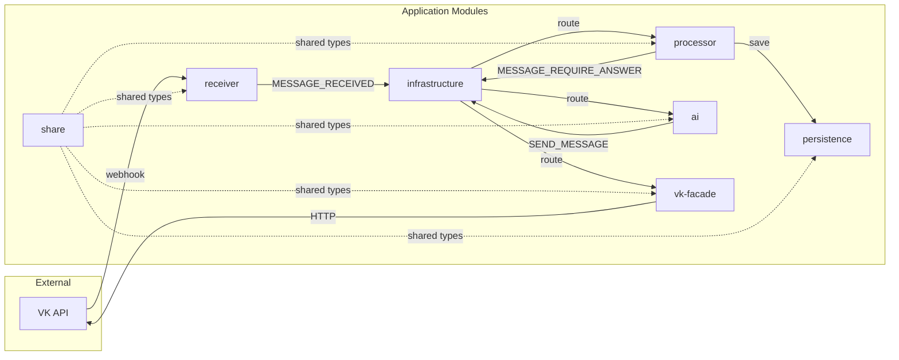

# Модульная структура

Проект организован по модульному принципу с четким разделением ответственности.
Каждый модуль выполняет свою специфическую роль в общей архитектуре системы.

## Модули приложения

### `app` - Точка входа

**Назначение**: Главный модуль запуска приложения

**Компоненты**:
- `Application.kt` - точка входа Quarkus приложения
- `application.yml` - основная конфигурация приложения
- Интеграционные тесты

**Зависимости**: Все остальные модули

---

### `receiver` - Точка входа системы

**Назначение**: Получение и первичная обработка webhook'ов от VK API

**Ключевые компоненты**:
- `VkMediatorRouter` - REST endpoint для VK callback'ов
- `VkMediatorRouterSecurityDecorator` - проверка секретного ключа
- `ReceiveMessageUsecase` - маршрутизация входящих событий
- `MessageMapper` - преобразование VK JSON в доменные объекты
- `PublishVkEventCommand` - публикация событий в очередь

**Паттерн DMZ (Demilitarized Zone)**:
```
VK API → Security Check → VK Event Mapping → Domain Events → RabbitMQ
```

Модуль работает как буферная зона между внешним VK API и внутренней доменной моделью, обеспечивая:
- Валидацию и безопасность входящих запросов
- Преобразование внешних форматов во внутренние
- Изоляцию изменений в VK API от остальной системы

---

### `processor` - Бизнес-логика системы

**Назначение**: Обработка сообщений и координация бизнес-процессов

**Ключевые компоненты**:
- `NewMessageEventProcessor` - обработка события MESSAGE_RECEIVED
- `NewMessageUsecaseInput` - принятие решения о необходимости ответа
- `MessageRequireAnswerEventProcessor` - обработка запроса на ответ
- `GenerateAnswerCommand` - команда генерации ответа

**Архитектура**:
```
RabbitMQ Event → Event Processor → Use Case → Command → Publish Next Event
```

Координирует работу модулей `ai` и `persistence`, управляя потоком обработки сообщений.

---

### `ai` - AI интеграция

**Назначение**: Генерация ответов с использованием LLM через LangChain4j

**Ключевые компоненты**:
- `MessageRequireAnswerEventProcessor` - обработка запросов на генерацию ответа
- `GenerateAnswerUsecase` - use case генерации ответа
- `GenerateAnswerOutputAdapter` - адаптер для AI сервиса
- `UserAnswerAiService` - интерфейс LangChain4j AI сервиса

**Технология**: Ollama локальная модель через LangChain4j

**Конфигурация Ollama**:
```yaml
quarkus:
  langchain4j:
    ollama:
      base-url: http://localhost:11434
      model-id: llama3.2
```

---

### `persistence` - Сохранение данных

**Назначение**: Хранение истории сообщений в PostgreSQL

**Ключевые компоненты**:
- `MessageReceivedEventProcessor` - обработка событий для сохранения
- `MessageRepositoryAdapter` - реализация репозитория
- `MessageEntity` - JPA сущность
- `JsonbConverter` - конвертер для JSONB полей

**Технологии**:
- PostgreSQL (основная БД)
- Liquibase (миграции схемы)

---

### `vk-facade` - Интеграция с VK API

**Назначение**: Отправка сообщений в VK API

**Ключевые компоненты**:
- `SendMessageEventProcessor` - обработка события SEND_MESSAGE
- `VkClient` - REST клиент для VK API
- `VkSendMessageOutputAdapter` - адаптер отправки сообщений
- `SendVkMessageCommand` - команда отправки
- `MessageSendUsecase` - use case отправки

**Архитектура**:
```
RabbitMQ Event → SendMessageProcessor → VK Client → HTTP POST → VK API
```

**VK API endpoints**:
- `messages.send` - отправка сообщений

---

### `infrastructure` - Инфраструктурные компоненты

**Назначение**: Кросс-модульная инфраструктура

**Компоненты**:
- `EventDispatcher` - маршрутизация событий RabbitMQ
- `CommandLoggingDecorator` - логирование команд
- `UsecaseLoggingDecorator` - логирование use case'ов
- `MapperConfig` - конфигурация Jackson для Kotlin
- `RetryStrategies` - стратегии повторных попыток (5s, 30s, 1m, 15m, 1h)
- `DlqFinalHandler` - обработка "мертвых" сообщений

**RabbitMQ конфигурация**:
- Exchange: `all-events` (основной)
- Retry exchange'ы: `retry-5s-exchange`, `retry-30s-exchange`, `retry-1m-exchange`, `retry-15m-exchange`, `retry-1h-exchange`
- DLQ: `dlq-final-exchange`

---

### `share` - Общие компоненты

**Назначение**: Переиспользуемые компоненты всех модулей

**Структура**:
```
share/
├── domain/
│   ├── model/Message.kt          # Основная бизнес-сущность
│   ├── vo/                       # Value Objects
│   │   ├── MessageText.kt
│   │   ├── PeerId.kt
│   │   ├── FromId.kt
│   │   └── ...
│   └── Event.kt                  # Доменные события
├── port/                         # Базовые интерфейсы портов
├── command/Command.kt            # Command pattern базовые интерфейсы
└── adapter/                      # Базовые интерфейсы адаптеров
```

**Value Objects**:
- `MessageText` - типобезопасный текст сообщения
- `PeerId` - идентификатор диалога
- `FromId` - идентификатор отправителя
- `ConversationMessageId` - идентификатор сообщения в диалоге
- `GroupId` - идентификатор группы VK
- `Date` - дата сообщения

---

### `testing` - Тестовая инфраструктура

**Структура**:

#### `arch-tests` - Архитектурные тесты
- `ModuleDependenciesTest` - проверка зависимостей между модулями
- `GradleDependenciesTest` - проверка Gradle зависимостей

#### `test-common` - Общие тестовые утилиты
- Общие extensions и helpers

#### `test-fixtures` - Fake Objects
- `FakeVkClient` - фейк VK API клиента
- `FakePublishEventOutputPort` - фейк публикации событий
- `FakeMessageProvider` - фабрика сообщений
- `FakeVoProvider` - фабрика Value Objects

---

## Межмодульное взаимодействие

### Поток событий
```
receiver → (MESSAGE_RECEIVED) → processor → (MESSAGE_REQUIRE_ANSWER) → ai
                                         ↓
                                    persistence
                                         ↓
ai → (SEND_MESSAGE) → vk-facade → VK API
```

### Диаграмма взаимодействия


```mermaid
flowchart LR
    subgraph "External"
        VK[VK API]
    end

    subgraph "Application Modules"
        R[receiver]
        P[processor]
        A[ai]
        PER[persistence]
        VF[vk-facade]
        INF[infrastructure]
        S[share]
    end

    VK -->|webhook| R
    R -->|MESSAGE_RECEIVED| INF
    INF -->|route| P
    P -->|save| PER
    P -->|MESSAGE_REQUIRE_ANSWER| INF
    INF -->|route| A
    A -->|SEND_MESSAGE| INF
    INF -->|route| VF
    VF -->|HTTP| VK

    S -.->|shared types| R
    S -.->|shared types| P
    S -.->|shared types| A
    S -.->|shared types| PER
    S -.->|shared types| VF
```

### Зависимости модулей

```
app:
  - ai, infrastructure, vk-facade, processor, receiver, persistence, share

receiver:
  - share, infrastructure

processor:
  - share, infrastructure

ai:
  - share, infrastructure

persistence:
  - share, infrastructure

vk-facade:
  - share

infrastructure:
  - share

share:
  - (no internal dependencies)
```

---

## Принципы модульной организации

### Разделение UseCase и Command

В архитектуре системы применяется разделение стандартных use case'ов из гексагональной архитектуры на два компонента:

**UseCase** - имплементация входящего порта:
- Описывает **что** именно должно произойти на высоком уровне
- Координирует выполнение бизнес-сценария
- Работает с доменными объектами
- Делегирует конкретную работу командам

**Command** - атомарное переиспользуемое действие:
- Описывает **как** выполнить конкретное действие
- Может иметь собственную бизнес-логику
- Использует один или несколько выходных портов
- Может переиспользоваться разными use case'ами или другими командами

```kotlin
// UseCase координирует процесс на высоком уровне
class NewMessageUsecaseInput {
    fun execute(message: Message) {
        // Что нужно сделать
        if (requiresAnswer(message)) {
            publishEventCommand.execute(Event.MESSAGE_REQUIRE_ANSWER, message)
        }
        saveMessageCommand.execute(message)  // Делегация команде
    }
}

// Command выполняет конкретное атомарное действие
class PublishVkEventCommandImpl {
    fun execute(event: Event, payload: Payload) {
        // Как именно публиковать событие
        val metadata = buildMetadata(event)
        emitter.send(Message.of(payload, metadata))
    }
}
```

### Слабая связанность
- Модули взаимодействуют только через события
- Нет прямых зависимостей между бизнес-модулями
- Каждый модуль имеет свой контекст и ports/adapters

### Высокая связность
- Внутри модуля все компоненты работают на одну цель
- Четкое разделение на слои внутри каждого модуля
- Явные интерфейсы (ports) для внешних взаимодействий

### Типовая структура модуля

```
module_name/
├── adapter/
│   ├── input/          # Входящие адаптеры (web, events)
│   └── output/         # Исходящие адаптеры (db, api)
├── command/            # Commands - атомарные переиспользуемые действия
├── config/             # Конфигурация модуля
├── domain/             # Доменная логика модуля (если есть)
│   ├── exception/      # Доменные исключения
│   └── vo/            # Value Objects модуля
├── port/
│   ├── input/         # Интерфейсы для входящих операций
│   └── output/        # Интерфейсы для исходящих операций
└── usecase/           # Use cases (бизнес-логика)
```

Эта структура обеспечивает единообразие и понятность архитектуры на всех уровнях системы.
