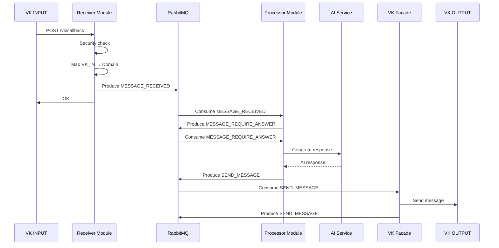

# Обзор архитектуры

VK Bot построен на основе **Clean Architecture** (Чистая архитектура) с применением **Event-driven** подхода, обеспечивающего высокую степень развязки, тестируемости и гибкости системы.

## 🏗️ Архитектурные принципы

### Clean Architecture
Проект строго следует принципам чистой архитектуры Роберта Мартина:

1. **Независимость от фреймворков** - бизнес-логика не зависит от Quarkus
2. **Тестируемость** - можно тестировать без внешних зависимостей
3. **Независимость от UI** - VK API можно заменить на Telegram или другой
4. **Независимость от базы данных** - PostgreSQL можно заменить на MongoDB
5. **Независимость от внешних сервисов** - AI провайдера можно поменять без изменения бизнес-логики

### Event-Driven Architecture

Система построена на событиях, что обеспечивает:
- **Асинхронную обработку** - каждый этап может выполняться независимо
- **Масштабируемость** - легко добавлять новые обработчики событий
- **Отказоустойчивость** - события можно переобрабатывать при сбоях
- **Наблюдаемость** - полный audit trail всех операций

## 🎯 Ключевые компоненты

### Domain Layer (Домен)
- **Entities**: `Message` - основная бизнес-сущность
- **Value Objects**: `MessageText`, `PeerId`, `FromId` и др. - типобезопасные примитивы
- **Events**: `MESSAGE_RECEIVED`, `MESSAGE_REQUIRE_ANSWER`, `SEND_MESSAGE`

### Application Layer (Приложение)
- **Use Cases**: координируют бизнес-процессы на высоком уровне, описывают **что** должно произойти
- **Ports**: интерфейсы для входящих и исходящих операций
- **Commands**: атомарные переиспользуемые действия, описывают **как** выполнить конкретное действие

**Разделение UseCase и Command**:
Use case является имплементацией входящего порта и координирует выполнение бизнес-сценария, делегируя конкретную работу командам. Commands выполняют атомарные действия, могут иметь собственную логику и использовать выходные порты, при этом переиспользуются разными use case'ами.

### Interface Adapters (Адаптеры интерфейсов)
- **Input Adapters**: REST контроллеры для VK webhook'ов
- **Output Adapters**: клиенты для VK API, AI сервисов
- **Event Processors**: обработчики доменных событий

### Infrastructure (Инфраструктура)
- **Message Broker**: RabbitMQ для событий
- **Web Framework**: Quarkus
- **Configuration**: YAML конфигурация

## 🔄 Основной поток обработки

## 🛡️ Безопасность и валидация

- **Security Decorator** - проверка секретного ключа VK
- **Value Objects** - валидация на уровне типов
- **Input Validation** - проверка входящих данных

## 🎨 Преимущества архитектуры

### Гибкость
- Легко заменить VK на другую платформу
- Можно поменять AI провайдера без изменения бизнес-логики
- Простое добавление новых типов событий

### Тестируемость  
- Каждый слой тестируется изолированно
- Fake objects вместо сложных моков
- Быстрые unit-тесты без внешних зависимостей

### Масштабируемость
- Асинхронная обработка через события
- Горизонтальное масштабирование обработчиков
- Независимое развертывание компонентов

### Maintainability
- Четкое разделение ответственности
- Слабая связанность между модулями
- Явные интерфейсы между слоями
